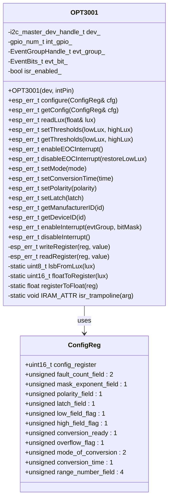
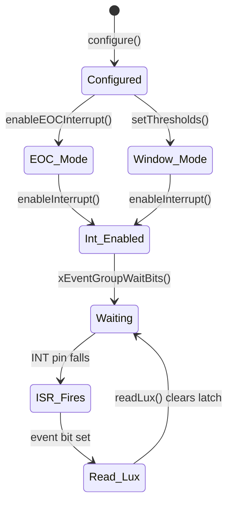

# ED_OPT3001 – Driver for TI OPT3001 Ambient Light Sensor

## Overview

The **ED_OPT3001** library provides a complete C++ driver for the Texas Instruments OPT3001 digital ambient light sensor, designed for ESP‑IDF 5.5 and the `I2CBus` wrapper. It supports:

- Continuous and single‑shot conversion modes
- End‑of‑Conversion (EOC) interrupt generation on GPIO
- Window comparator mode with programmable low/high thresholds
- Automatic full‑scale range selection
- Lux value conversion from the sensor’s exponent/mantissa format

The driver uses the ESP‑IDF I2C master driver and integrates with FreeRTOS event groups for interrupt handling.

---

## Class Diagram



---

## API Reference

### Constants

| Name                       | Value   | Description                         |
|----------------------------|---------|-------------------------------------|
| `RESULT_REG`               | 0x00    | Result register address             |
| `CONFIG_REG`               | 0x01    | Configuration register address      |
| `LOW_LIMIT_REG`            | 0x02    | Low threshold register address      |
| `HIGH_LIMIT_REG`           | 0x03    | High threshold register address     |
| `MANUFACTURER_ID_REG`      | 0x7E    | Manufacturer ID register            |
| `DEVICE_ID_REG`            | 0x7F    | Device ID register                  |
| `MANUFACTURER_ID`          | 0x5449  | Expected manufacturer ID            |
| `DEVICE_ID`                | 0x3001  | Expected device ID                  |
| `RN_AUTO`                  | 0x0C    | Auto‑range setting for config       |
| `TIMEOUT_MS`               | 1000    | I2C timeout in milliseconds         |

### Enumerations

#### `ConversionMode`
| Value          | Description                                 |
|----------------|---------------------------------------------|
| `LOWPOWER`     | Shutdown (lowest power)                     |
| `SINGLE_SHOT`  | Perform one conversion then shutdown        |
| `CONTINUOUS_A` | Continuous mode A (identical to B)          |
| `CONTINUOUS_B` | Continuous mode B (identical to A)          |

#### `ConversionTime`
| Value          | Integration time |
|----------------|------------------|
| `TIME_100MS`   | 100 ms           |
| `TIME_800MS`   | 800 ms           |

#### `Polarity`
| Value              | Interrupt polarity      |
|--------------------|-------------------------|
| `INT_ACTIVE_LOW`   | Active low (default)    |
| `INT_ACTIVE_HIGH`  | Active high             |

#### `Latch`
| Value                | Behaviour                                                                 |
|----------------------|---------------------------------------------------------------------------|
| `LATCH_TRANSPARENT`  | INT pin clears automatically when light returns within limits            |
| `LATCH_WINDOW`       | INT stays asserted until config or result register is read               |

### Constructor

```cpp
OPT3001(i2c_master_dev_handle_t dev, gpio_num_t intPin = GPIO_NUM_NC);
```

- **dev** – I2C master device handle obtained from `I2CBus::get_device()`
- **intPin** – GPIO number for the interrupt pin (set to `GPIO_NUM_NC` if unused)

### Core Methods

#### `esp_err_t configure(const ConfigReg& cfg)`
Writes the entire configuration register.

#### `esp_err_t getConfig(ConfigReg& cfg)`
Reads the current configuration.

#### `esp_err_t readLux(float& lux)`
Performs a single lux reading (if in continuous mode, returns the latest result). Returns `ESP_OK` and fills `lux` on success.

#### `esp_err_t setThresholds(float lowLux, float highLux)`
Sets the low and high thresholds for window comparator mode. `highLux` must be greater than `lowLux`. Valid range: 0.01 – 83865.60 lux.

#### `esp_err_t getThresholds(float& lowLux, float& highLux)`
Retrieves the currently programmed thresholds.

#### `esp_err_t enableEOCInterrupt()`
Configures the low limit register for End‑Of‑Conversion (EOC) mode – the INT pin will assert after every completed conversion.

#### `esp_err_t disableEOCInterrupt(float restoreLowLux)`
Restores normal window mode by writing a valid low threshold value.

### Convenience Setters

- `setMode(uint8_t conversion_mode)`
- `setConversionTime(uint8_t conv_time)`
- `setPolarity(uint8_t polarity)`
- `setLatch(uint8_t latch)`

All return `ESP_OK` on success.

### Device Identification

- `getManufacturerID(uint16_t& id)`
- `getDeviceID(uint16_t& id)`

Useful for verifying the sensor is present.

### Interrupt Management

#### `esp_err_t enableInterrupt(EventGroupHandle_t evtGroup, EventBits_t bitMask)`

Configures the interrupt GPIO as input with pull‑up, installs the ISR service, and sets the specified bit in the event group whenever the INT pin asserts (falling edge). Must be called after the sensor is configured.

#### `esp_err_t disableInterrupt()`

Removes the ISR handler and disables interrupts on the GPIO.

---

## Usage Examples

### 1. Basic Continuous Reading (no interrupt)

```cpp
#include "ED_i2c.h"
#include "ED_OPT3001.h"

I2CBus i2c(I2C_NUM_0, GPIO_NUM_21, GPIO_NUM_22, 400000);
i2c_master_dev_handle_t dev;
i2c.get_device(0x44, &dev);

ED_OPT3001::OPT3001 sensor(dev, GPIO_NUM_NC);

ED_OPT3001::OPT3001::ConfigReg cfg{};
cfg.mode_of_conversion = ED_OPT3001::OPT3001::CONTINUOUS_B;
cfg.conversion_time    = ED_OPT3001::OPT3001::TIME_800MS;
cfg.range_number_field = ED_OPT3001::OPT3001::RN_AUTO;
sensor.configure(cfg);

float lux;
while (true) {
    sensor.readLux(lux);
    printf("Lux: %.2f\n", lux);
    vTaskDelay(pdMS_TO_TICKS(1000));
}
```

### 2. Interrupt‑Driven Reading (EOC mode, GPIO 6)

```cpp
#include "freertos/event_groups.h"

#define OPT3001_INT_BIT BIT0

EventGroupHandle_t evt = xEventGroupCreate();

I2CBus i2c(I2C_NUM_0, GPIO_NUM_21, GPIO_NUM_22, 400000);
i2c_master_dev_handle_t dev;
i2c.get_device(0x44, &dev);

ED_OPT3001::OPT3001 sensor(dev, GPIO_NUM_6);

// Configure continuous mode, EOC interrupt
ED_OPT3001::OPT3001::ConfigReg cfg{};
cfg.mode_of_conversion = ED_OPT3001::OPT3001::CONTINUOUS_B;
cfg.conversion_time    = ED_OPT3001::OPT3001::TIME_800MS;
cfg.range_number_field = ED_OPT3001::OPT3001::RN_AUTO;
sensor.configure(cfg);
sensor.enableEOCInterrupt();

// Enable GPIO interrupt
sensor.enableInterrupt(evt, OPT3001_INT_BIT);

float lux;
while (true) {
    xEventGroupWaitBits(evt, OPT3001_INT_BIT, pdTRUE, pdFALSE, portMAX_DELAY);
    sensor.readLux(lux);
    ESP_LOGI("MAIN", "Lux: %.2f", lux);
}
```

### 3. Window Comparator Mode with Thresholds

```cpp
// Set low = 10 lux, high = 1000 lux
sensor.setThresholds(10.0f, 1000.0f);

// Configure latch mode and polarity
sensor.setLatch(ED_OPT3001::OPT3001::LATCH_WINDOW);
sensor.setPolarity(ED_OPT3001::OPT3001::INT_ACTIVE_LOW);

// Enable interrupt as before – will trigger when light leaves the window
sensor.enableInterrupt(evt, OPT3001_INT_BIT);
```

### 4. Single‑Shot Measurement

```cpp
sensor.setMode(ED_OPT3001::OPT3001::SINGLE_SHOT);
vTaskDelay(pdMS_TO_TICKS(100));  // allow conversion
float lux;
sensor.readLux(lux);
```

---

## Mermaid State Diagram (Interrupt Flow)



---

## Error Handling

All methods return `esp_err_t`. Common errors:

- `ESP_ERR_INVALID_ARG` – invalid parameter (e.g., threshold order)
- `ESP_ERR_TIMEOUT` – I2C communication timeout
- `ESP_FAIL` – general failure (e.g., sensor not responding)

Always check return values, especially after `readLux()` and `configure()`.

---

## Integration with I2CBus

The driver expects an **already created** I2C device handle. Use the `I2CBus` wrapper:

```cpp
I2CBus bus(I2C_NUM_0, SDA_PIN, SCL_PIN, 400000);
i2c_master_dev_handle_t opt_handle;
bus.get_device(OPT3001_ADDR, &opt_handle);
OPT3001 sensor(opt_handle, INT_PIN);
```

Do **not** use the removed `OPT3001::addDevice()` method.

---

## Dependencies

- ESP‑IDF v5.5 or later
- `driver/i2c_master.h`
- `freertos/FreeRTOS.h`
- `freertos/event_groups.h`
- `esp_check.h`
- `ED_i2c` (I2CBus wrapper)

---

## Revision History

| Version | Date       | Changes                                                      |
|---------|------------|--------------------------------------------------------------|
| 0.2     | 2026-05-17 | Refactored for ESP‑IDF 5.5; removed `addDevice()`; added EOC API; fixed ISR logic |
```